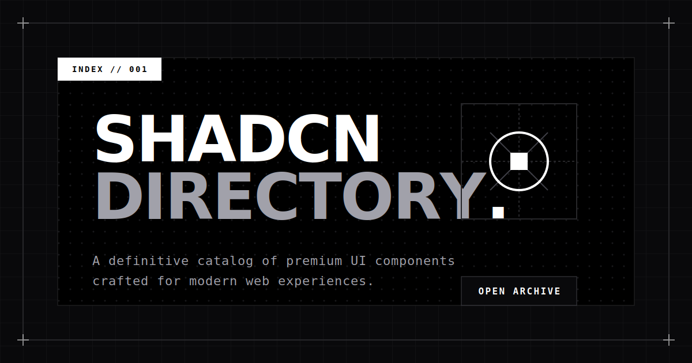

<div align="center">
  
  <h1>SHADCN // DIRECTORY.</h1>
  <p>An open-source, definitive catalog of premium components, templates, and UI kits crafted for modern web experiences.</p>

  
</div>

## Overview

**ShadCN Directory** is a beautifully designed, high-performance web directory product engineered for discovering and sharing the best UI components, templates, and boilerplates built around the `shadcn/ui` ecosystem.

Designed with a strict, monochrome **Swiss Minimalist aesthetic**, it operates as a turn-key platform for developers to find premium building blocks for their next product, while also serving as a robust, scalable codebase that can be deployed as-is or customized for your own directory needs.

## How to Add a Resource

Adding a new ShadCN resource to the directory is simple:

1. **Sign In** — Click the sign-in button and authenticate with your Google account.
2. **Open the Add Dialog** — Click the **"+ Add Resource"** button on the homepage.
3. **Paste the URL** — Enter the URL of the ShadCN component library, template, or UI kit you want to share. The app will automatically scrape its OpenGraph metadata (title, description, image).
4. **Submit** — Hit submit. Your resource is now sent for review.
5. **Admin Review** — An admin will approve or reject the submission. You'll see its status on your **Profile** page (`/profile`).
6. **Live!** — Once approved, the resource appears on the public directory for everyone to discover.

## Contributing

Contributions are welcome! Here's how to get started:

1. **Fork** the repository.
2. **Clone** your fork locally:
   ```bash
   git clone https://github.com/<your-username>/shadcn-directory.git
   cd shadcn-directory
   pnpm install
   ```
3. **Create a branch** for your changes:
   ```bash
   git checkout -b feat/your-feature-name
   ```
4. **Set up environment** — Copy `.env.example` or create a `.env.local` with the required variables (see [Quick Start Guide](#quick-start-guide) below).
5. **Make your changes** and test locally with `pnpm run dev`.
6. **Commit & Push**:
   ```bash
   git add .
   git commit -m "feat: describe your change"
   git push origin feat/your-feature-name
   ```
7. **Open a Pull Request** against the `main` branch with a clear description of what you changed and why.

> **Note:** Please keep PRs focused on a single change. Bug fixes, new features, and documentation improvements are all welcome.

## Tech Stack

| Technology | Purpose |
|---|---|
| [Next.js](https://nextjs.org/) | Framework (App Router, Server Actions) |
| [Tailwind CSS](https://tailwindcss.com/) | Styling |
| [Shadcn UI](https://ui.shadcn.com/) | UI Components |
| [MongoDB](https://www.mongodb.com/) & Mongoose | Database |
| [NextAuth.js](https://next-auth.js.org/) | Authentication (Google OAuth) |
| [Sonner](https://sonner.emilkowal.ski/) | Toast Notifications |

## Quick Start Guide

### Prerequisites

Ensure you have [Node.js](https://nodejs.org/) and [pnpm](https://pnpm.io/) installed.

### 1. Clone & Install

```bash
git clone https://github.com/avijit07x/shadcn-directory.git
cd shadcn-directory
pnpm install
```

### 2. Configure Environment

Create a `.env.local` file in the root directory and configure the following variables:

```env
# Database
MONGODB_URI=your_mongodb_connection_string

# Authentication (NextAuth)
NEXTAUTH_URL=http://localhost:3000
NEXTAUTH_SECRET=your_nextauth_secret_random_string

# Google OAuth Credentials
GOOGLE_CLIENT_ID=your_google_client_id
GOOGLE_CLIENT_SECRET=your_google_client_secret

# Admin Access
# Comma-separated list of emails that should have admin access
ADMIN_EMAILS=admin@example.com,moderator@example.com
```

### 3. Launch Development Server

```bash
pnpm run dev
```

The application will be available at `http://localhost:3000`.

## Project Structure

| Directory | Description |
|---|---|
| `app/` | Next.js App Router pages & API routes |
| `components/` | Reusable React components |
| `lib/` | Utilities (DB connection, rate limiting, OG scraper) |
| `models/` | Mongoose database models |
| `public/` | Static assets |

## License

[MIT](LICENSE)
